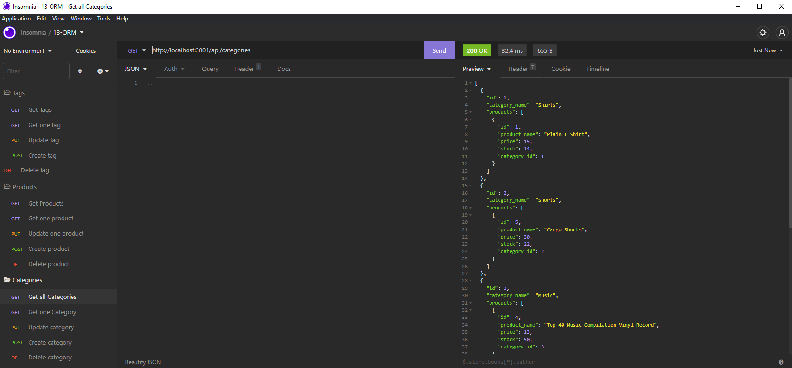

# E-Commerce-BackEnd

## Table of Contents
[Description](#Description)

[Usage](#Usage)

[Visuals](#Visuals)

[Resources](#resources)

## Description

- Click on the image below to see the walkthrough of the application
- Configured an Express.js API to use Sequelize and MYSQL Database.

## Usage
- Invoke the program using node index.js, or nodemon as shown in the video.
- Open Insomnia and create each CRUD operation that you see in the image below.
- Run the CRUD operations and watch the database update whatever input you give it.

# Visuals

# Resources

[Repository](https://github.com/ntraugh/E-Commerce-BackEnd)